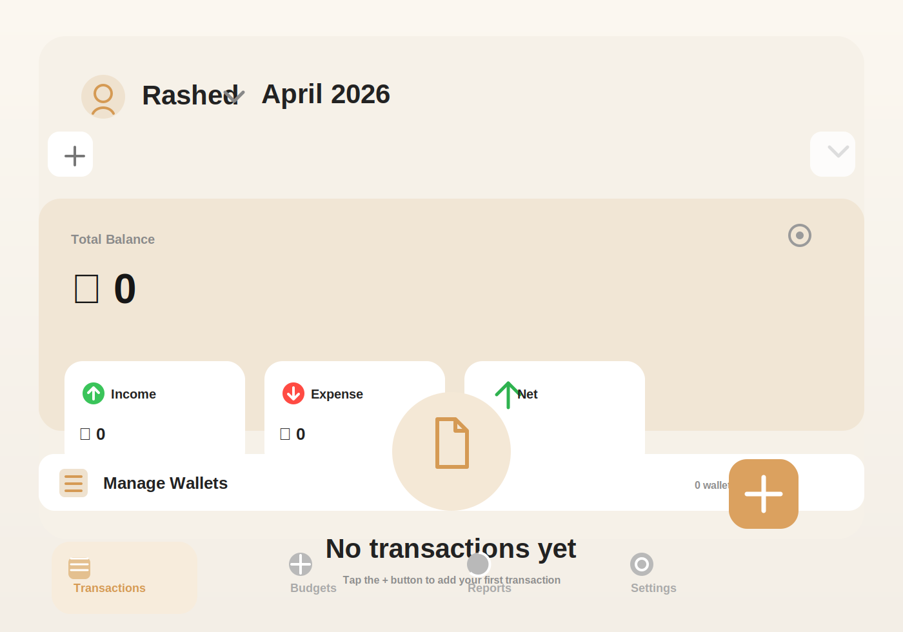

# Amar Khoroch



Amar Khoroch is a clean, local-first expense tracker built for Bangladesh. It helps you track income, expense, wallets, budgets, monthly reports, and workspace-based financial profiles in one place.

## What it does

- Track daily income, expense, and transfer transactions.
- Manage multiple wallets and keep balances in sync.
- Create separate workspaces for different financial profiles.
- Set monthly budgets per category and compare spend against limits.
- View monthly totals, category breakdowns, and report charts.
- Protect the app with PIN lock and hide sensitive amounts when needed.

## App Preview

The preview below is included as a lightweight SVG so it renders nicely on GitHub without needing an extra screenshot upload.

## Tech Stack

- Flutter
- Riverpod
- Hive
- fl_chart
- intl

## Project Structure

- `lib/main.dart` initializes Hive and launches the app.
- `lib/app.dart` configures the app theme and lifecycle security lock.
- `lib/app_wrapper.dart` decides whether to show PIN, setup, or the main app.
- `lib/providers/` contains app state, computed totals, and persistence logic.
- `lib/screens/` contains the UI for transactions, budgets, reports, settings, workspaces, accounts, and security.
- `lib/data/` contains models, repositories, and Hive setup.

## Key Features

- Workspace-based data separation
- Wallet balance synchronization
- Monthly budget summaries
- Income and expense reporting
- Amount visibility toggle
- PIN-based app lock

## Build And Run

```bash
flutter pub get
flutter run
```

## Notes

- Data is stored locally with Hive.
- The app is designed for personal expense tracking and presentation use.

