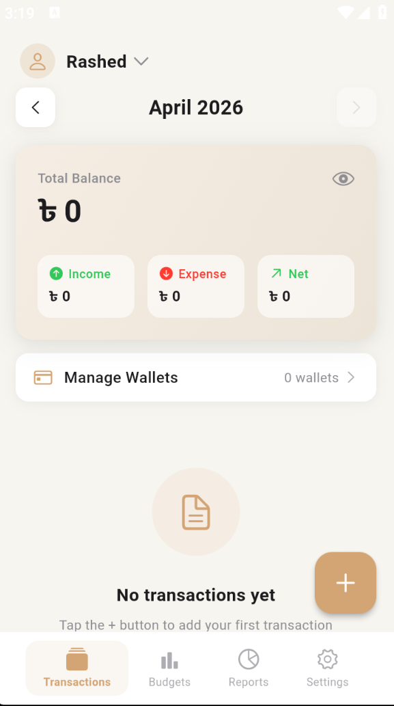

<div align="center">



<br/>

# আমার খরচ — Amar Khoroch
### 🇧🇩 Bangladesh's Personal Finance Tracker

<p align="center">
  
  
  
  
</p>

<p align="center">
  
  
  
  
</p>

---

## 📲 Download Now

<table align="center">
  <tr>
    <td align="center" width="50%">
      <a href="https://github.com/rashed76656/Amar-Khoroch/releases/download/v1.0.0/Amar.Khoroch-arm64.apk">
        
        <br/><br/>
        <sub>📱 <b>For Real Devices</b></sub>
        <br/>
        <sub>Samsung · Xiaomi · Realme · Oppo</sub>
        <br/>
        <sub>Snapdragon · Dimensity · Exynos</sub>
      </a>
    </td>
    <td align="center" width="50%">
      <a href="https://github.com/rashed76656/Amar-Khoroch/releases/download/v1.0.0/Amar.Khoroch-x64.apk">
        
        <br/><br/>
        <sub>💻 <b>For Emulators</b></sub>
        <br/>
        <sub>Android Studio AVD · Genymotion</sub>
        <br/>
        <sub>BlueStacks · LDPlayer · NoxPlayer</sub>
      </a>
    </td>
  </tr>
</table>

> **⚠️ Installation Note:** Enable **"Install from Unknown Sources"** in Android Settings before installing.

---

</div>

## ✨ Features

<table>
  <tr>
    <td>📊</td>
    <td><b>Smart Dashboard</b></td>
    <td>Real-time balance, income & expense overview at a glance</td>
  </tr>
  <tr>
    <td>💸</td>
    <td><b>Transaction Tracking</b></td>
    <td>Log income, expenses & transfers with categories and notes</td>
  </tr>
  <tr>
    <td>🗂️</td>
    <td><b>Custom Categories</b></td>
    <td>13 default expense + 5 income categories, fully customizable</td>
  </tr>
  <tr>
    <td>🏦</td>
    <td><b>Multiple Wallets</b></td>
    <td>Cash, Bank, bKash, Nagad, Rocket — manage all accounts</td>
  </tr>
  <tr>
    <td>📈</td>
    <td><b>Visual Reports</b></td>
    <td>Donut charts with category-wise spending breakdown</td>
  </tr>
  <tr>
    <td>🌙</td>
    <td><b>Dark Mode</b></td>
    <td>Beautiful dark theme with Liquid Glass design</td>
  </tr>
  <tr>
    <td>🔒</td>
    <td><b>PIN Protection</b></td>
    <td>Secure your data with 4-digit PIN lock</td>
  </tr>
  <tr>
    <td>📤</td>
    <td><b>Export Data</b></td>
    <td>Export transactions as CSV or PDF report</td>
  </tr>
  <tr>
    <td>🇧🇩</td>
    <td><b>বাংলা Support</b></td>
    <td>Full Bengali language support with ৳ Taka currency</td>
  </tr>
  <tr>
    <td>📵</td>
    <td><b>100% Offline</b></td>
    <td>No internet required — all data stays on your device</td>
  </tr>
</table>

---

## 📱 Screenshots

<div align="center">

| Home Screen | Add Transaction | Reports | Categories |
|:-----------:|:---------------:|:-------:|:----------:|
| Balance overview with Liquid Glass card | Quick transaction entry with smart form | Donut chart with category breakdown | Customizable expense & income categories |

</div>

---

## 🛠️ Tech Stack

```
Flutter 3.22+           →  Cross-platform UI framework
Riverpod 2.5            →  State management
drift (SQLite)          →  Local database (offline-first)
go_router               →  Navigation
fl_chart                →  Beautiful charts
Liquid Glass Design     →  iOS 26-inspired UI on Android
Nunito + Noto Bengali   →  Typography
SHA-256 (crypto)        →  PIN security
```

---

## 🚀 Getting Started

### Prerequisites

```bash
flutter --version   # Flutter 3.22.0 or higher
```

### Installation

```bash
# 1. Clone the repository
git clone https://github.com/rashed76656/Amar-Khoroch.git

# 2. Navigate to project directory
cd Amar-Khoroch

# 3. Install dependencies
flutter pub get

# 4. Run code generation
dart run build_runner build --delete-conflicting-outputs

# 5. Run the app
flutter run
```

### Build APK

```bash
# ARM64 (Real devices)
flutter build apk --release --target-platform android-arm64

# x64 (Emulators)
flutter build apk --release --target-platform android-x64
```

---

## 📂 Project Structure

```
lib/
├── core/               # Theme, colors, typography, Liquid Glass
├── data/               # Database, models, repositories
│   ├── database/       # drift SQLite schema
│   ├── models/         # Transaction, Account, Category
│   └── repositories/   # Data access layer
├── features/
│   ├── transactions/   # Home screen & transaction list
│   ├── add_transaction/# Add/Edit transaction sheet
│   ├── reports/        # Charts & analytics
│   ├── categories/     # Category management
│   ├── accounts/       # Wallet management
│   ├── settings/       # App preferences
│   └── security/       # PIN lock
├── shared/             # Reusable widgets
├── l10n/               # বাংলা & English strings
└── main.dart
```

---

## 🎨 Design System

| Token | Value | Usage |
|-------|-------|-------|
| Primary Blue | `#007AFF` | Action buttons |
| Income Green | `#34C759` | Income amounts |
| Expense Red | `#FF3B30` | Expense amounts |
| Taka Gold | `#C6962A` | ৳ symbol |
| Amber FAB | `#F5A623` | Floating action button |
| Glass Surface | `rgba(255,255,255,0.72)` | Liquid Glass cards |

---

## 🔐 Privacy & Security

- ✅ All data stored **locally** on device only
- ✅ No internet connection required
- ✅ No data sent to any server
- ✅ PIN protected with **SHA-256 hashing**
- ✅ Plain text PIN never stored
- ✅ Auto-lock support (instant / 1 min / 5 min)

---

## 🌐 Language Support

| Language | Status |
|----------|--------|
| বাংলা (Bengali) | ✅ Default |
| English | ✅ Supported |

---

## 📋 Default Categories

**Expense:** খাদ্য · বিল · পরিবহন · কেনাকাটা · উপহার · শিক্ষা · ভাড়া · ভ্রমণ · স্বাস্থ্য · জিম · বিদ্যুৎ · জ্বালানি · বিনোদন

**Income:** বেতন · ব্যবসা · ফ্রিল্যান্স · পুরস্কার · অন্যান্য

---

## 🤝 Contributing

Contributions are welcome! Please feel free to submit a Pull Request.

1. Fork the repository
2. Create your feature branch (`git checkout -b feature/AmazingFeature`)
3. Commit your changes (`git commit -m 'Add some AmazingFeature'`)
4. Push to the branch (`git push origin feature/AmazingFeature`)
5. Open a Pull Request

---

## 📄 License

This project is licensed under the MIT License — see the [LICENSE](LICENSE) file for details.

---

## 📬 Contact & Support

<div align="center">

Have a bug to report or a feature to suggest?
👉 [Open an Issue](https://github.com/rashed76656/Amar-Khoroch/issues)

</div>

---

<div align="center">

<br/>

**⭐ If you find this app helpful, please give it a star!**

<br/>

---

Made by **Raxhu**❤️ | Bangladesh 🇧🇩

</div>
